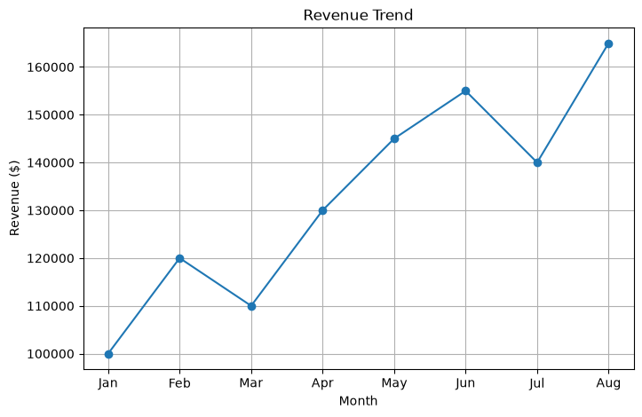

# AI Business Insight Generator

## Overview

This project analyzes Excel sales data and automatically generates executive summaries using Python.

## Revenue Trend

## AI Executive Summary Example

This project uses OpenAI API to generate business insights automatically.

Example output:

> Overall results are strong with a positive month-to-month trend and a clear opportunity to convert peak-month learnings into steadier, higher recurring monthly revenue.

## Business Problem

Business users often spend time manually reviewing sales reports and summarizing key trends.

## Solution

This application:

- Reads Excel sales data
- Calculates key revenue metrics
- Identifies best and worst performing months
- Calculates month-over-month growth
- Generates executive summary reports
- Exports results to text files

## Technologies

- Python
- Pandas
- OpenPyXL
- Git
- GitHub

## Sample Output

Revenue reached $1,065,000 across the reporting period.

The strongest month was Aug with revenue of $165,000.

Revenue increased in 5 months and declined in 2 months.

Overall, revenue showed a generally positive trend.

## Future Enhancements

- OpenAI API integration
- AI-generated management commentary
- Interactive dashboard
- PDF report generation